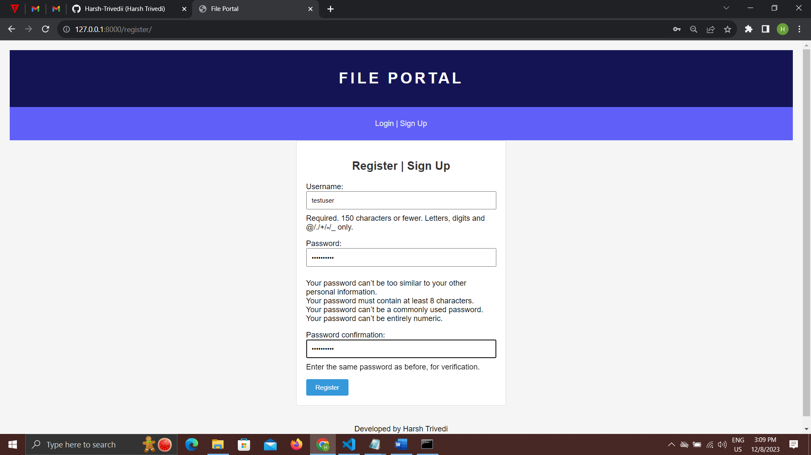
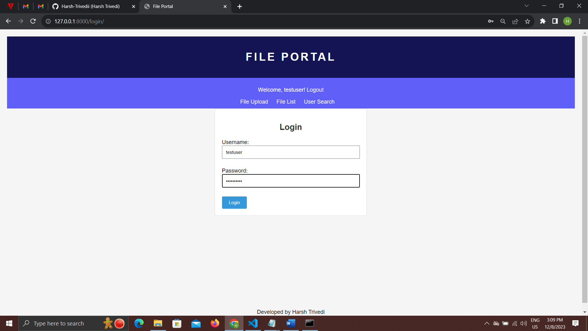
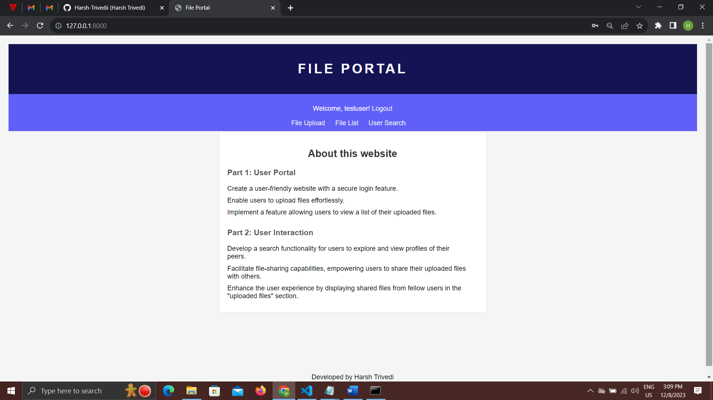
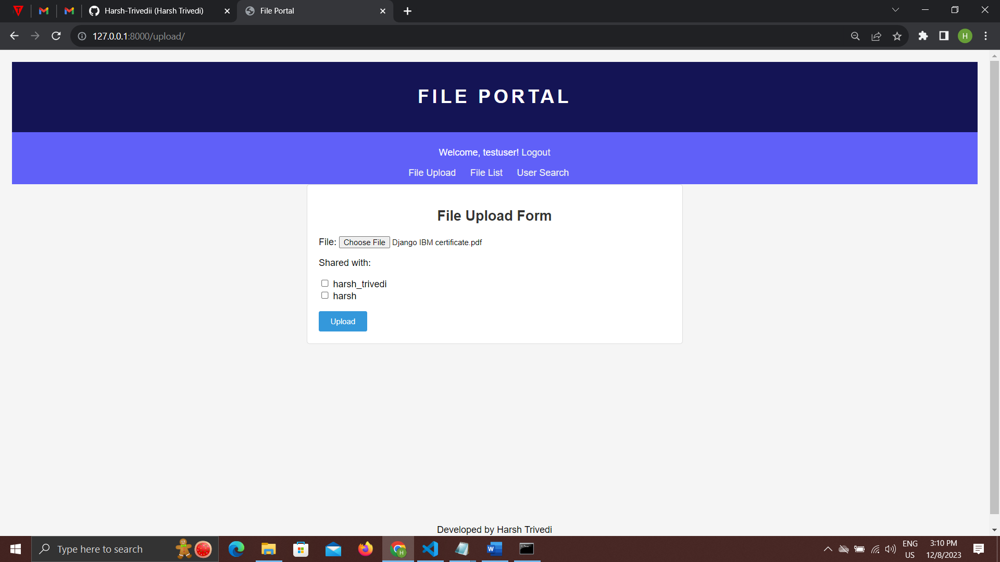
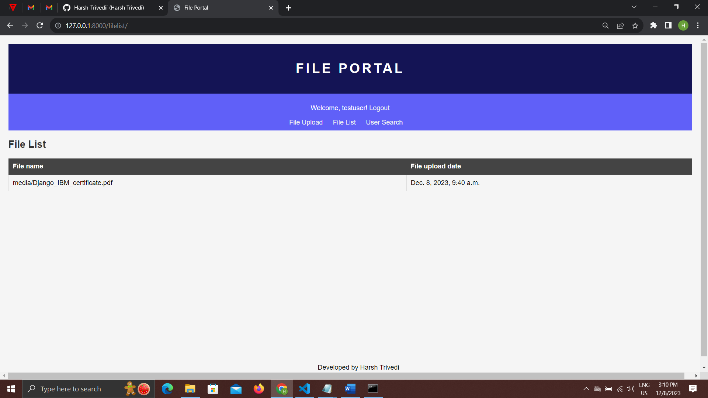
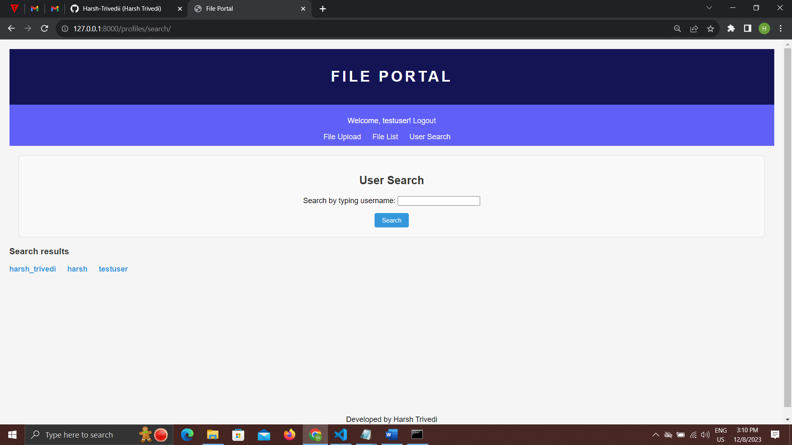
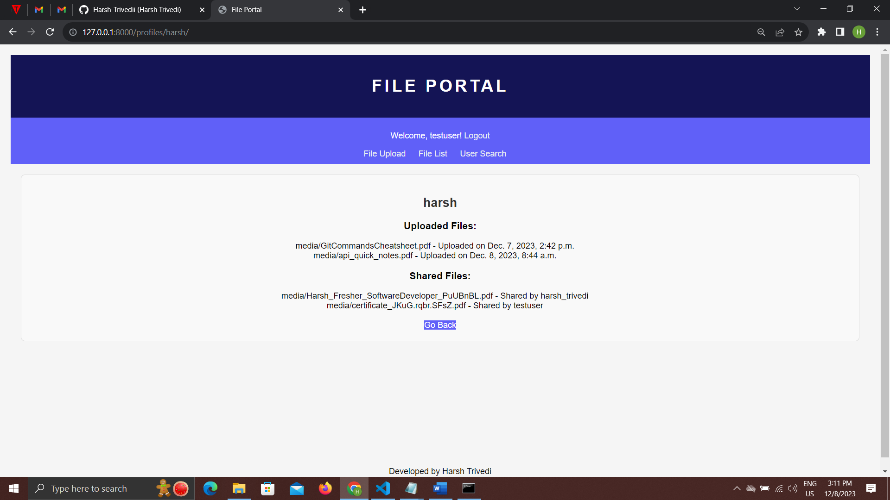

File Portal Project

Part 1: User Portal
🌐 Overview
This project aims to create a user-friendly web portal with various features to streamline file management. Users can securely log in, upload files, and view a list of their uploaded files.

🚀 Features
Secure Login:
Users can securely log in to their accounts, ensuring data privacy.

Effortless File Upload:
The portal provides a seamless file upload feature, allowing users to easily share their documents.

File List View:
Users can view a comprehensive list of the files they have uploaded, facilitating easy file management.

Part 2: User Interaction
🌟 Overview
Building upon the user portal, this part focuses on enhancing user interaction. It introduces search functionality, file-sharing capabilities, and an improved user experience by displaying shared files.

🚀 Features
User Profile Search:
Users can explore and view profiles of their peers through a search functionality.

File Sharing:
The portal empowers users to share their uploaded files with others, fostering collaboration.

Enhanced User Experience:
Shared files from fellow users are displayed in the "uploaded files" section, providing a more enriched user experience.

🚀 Getting Started
Follow these steps to set up and run the project on your local machine.

1. Clone the Repository:
       git clone https://github.com/your-username/file-portal.git
2. Install Dependencies:
       pip install -r requirements.txt
3. Set DEBUG=True in settings.py

4. Create a media folder at the root directory

5. Run the localserver-
     python manage.py runserver

6. Access the Portal:
    Open your web browser and go to http://127.0.0.1:8000/ to access the File Portal.

Flow of the Website-
Sign Up: Create a new account by providing the necessary information.
Login: Log in to your account with your credentials.
Home: Navigate to the home page after successful login.
Menu Options:
You can select between the following options from the menu:
Upload: Choose to upload files.
File List: View a list of your uploaded files.
Search: Explore and search for other users.
Upload:
If you choose to upload, after a successful upload, you will be redirected to the file list.
Search:
Clicking on the search menu allows you to view profiles of other users.

Registration Page-

Login Page-

Home Page-

File Upload Page-

File list page- 

Search Users-

User Profile 1-

User Profile 2-

